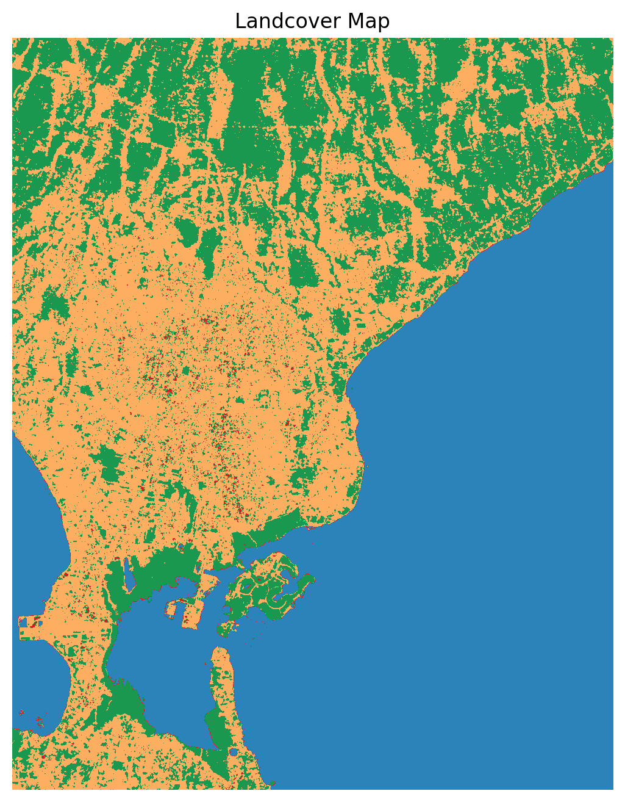

# 🌍 **Landcover Classification — Denpasar, Bali**  
### 🛰 Remote Sensing • Machine Learning • GIS • Python  

---

  

## 📌 **Overview**

This project builds a **Landcover Classification Map** for **Denpasar, Bali**, using:

- ✔ Sentinel-2 Multiband Imagery  
- ✔ Fully automatic training data (no manual digitizing!)  
- ✔ NDVI / NDWI / NDBI + 6 Sentinel bands  
- ✔ Random Forest Machine Learning  
- ✔ Export GeoTIFF, PNG, and polygonized GPKG  
- ✔ Ready for GIS evaluation (Turing RLHF / GeoAI roles)

---

## 🗂 **Data Sources**

| Dataset | Source | Notes |
|--------|--------|-------|
| 🌈 Sentinel-2 Multiband (B2,B3,B4,B8,B11,B12) | Google Earth Engine | Cloud-masked |
| 🗺 Auto Training Polygons | NDVI/SCL/NDWI rules | No QGIS needed |
| 📍 AOI | Denpasar, Bali | Approx. UTM 50S |

---

## ⚙️ **Methodology**

### **1️⃣ Prepare Multiband Raster**
- Read 6 Sentinel-2 bands  
- Scale reflectance (0–1)  
- Compute indices: NDVI, NDWI, NDBI  

---

### **2️⃣ Auto Training Data**

Training polygons generated using rules:

| Class | Label | Rule |
|------|--------|------|
| 1 | Water | NDWI > 0 |
| 2 | Urban | NDBI > 0.1 **and** NDVI < 0.3 |
| 3 | Vegetation | NDVI > 0.3 |
| 4 | Bare Land | Else |

**Preview:**  
`/outputs/maps/training_polygons_preview.png`

---

### **3️⃣ Train ML Classifier**
- RandomForestClassifier  
- 200 trees  
- Max depth: 20  
- Train/Test split: 80/20  

---

### **4️⃣ Predict Landcover**
- Full **2784 × 2228** raster classified.

---

### **5️⃣ Export Outputs**

- `landcover_map.tif`  
- `landcover_map.png`  
- `landcover_polygonized.gpkg`  

---

## 🎨 **Landcover Class Legend (1–4)**

| Class | Name | Color |
|------|-------|--------|
| 1 | Water | 🟦 `#2b83ba` |
| 2 | Urban / Built-up | 🟥 `#d7191c` |
| 3 | Vegetation | 🟩 `#1a9850` |
| 4 | Bare Land | 🟧 `#fdae61` |

---

## 🗺 **Final Output (PNG)**

  

---

## 📁 **Output Files**

### **Raster** (`data/processed/`)
- `landcover_map.tif`

### **Vector** (`outputs/shapefiles/`)
- `landcover_polygonized.gpkg`

### **Maps** (`outputs/maps/`)
- `training_polygons_preview.png`  
- `landcover_map.png`

---

## 🧪 **Model Metrics**

### **Classification Report**
- Precision / Recall / F1 score per class

### **Confusion Matrix**
- Distribution of predicted vs true labels

---

## 🧠 **Skills Demonstrated**
- Multiband Satellite Processing  
- Spectral Index Computation (NDVI, NDWI, NDBI)  
- Automatic Labeling  
- Machine Learning (Random Forest)  
- Geospatial Raster/Vector Handling  
- GIS QA/QC  
- Spatial Model Evaluation  

---

## 👤 **Author**

**Samueli Windovado Fau**  
🌐 GitHub: https://github.com/samuelifau  
💼 LinkedIn: https://www.linkedin.com/in/samueli-fau  

---

⭐ *If this project helps, please star the repository!*

